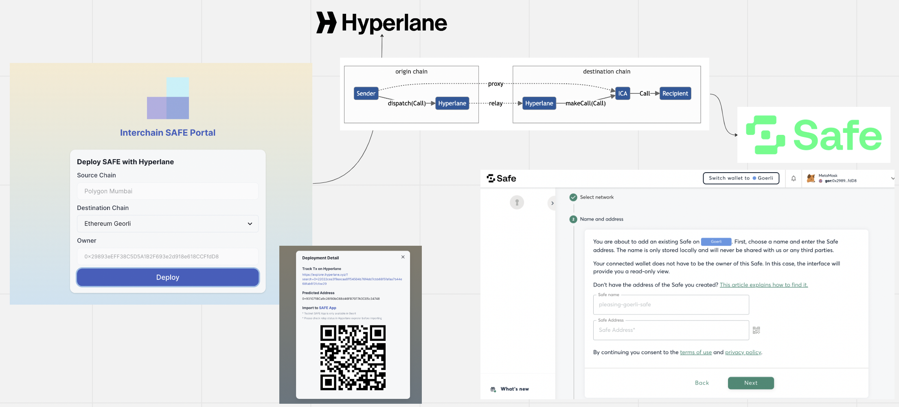

# Interchain Safe Portal

a One-stop SAFE deployment portal with Hyperlane

## Submission

### Live App

https://interchain-safe-portal.vercel.app/

### Pitch Deck

https://docs.google.com/presentation/d/168juHv1bIAsz5gmniO9YCZgkpLX7ZKSwFyMM62HlKFE/edit?usp=sharing

### Demo

https://youtu.be/IK02iAsKLoY

## Overview

Interchain SAFE Portal is a one-stop SAFE deployment portal built with Hyperlane.

Users can choose a destination chain and make SAFE deployment tx from any chain which is supported by Hyperlane.

Deployed SAFE can be imported to the SAFE app.

Safe can be deployed from any chain to any chain with Hyperlane. This is a cross-chain batch tx app for better UX.

## How it works

## Deployments and Test

### Cross-chain Tx

#### Moonbeam -> Ethereum

https://explorer.hyperlane.xyz/message/113828

https://goerli.etherscan.io/tx/0xb211799fa3578f6b129cfcf04467f86170be1a79f7c212778f12582850cb64a6

#### Ethereum -> Moonbeam

https://explorer.hyperlane.xyz/message/113839

https://goerli.etherscan.io/tx/0x2ca54c8be6c007fbd34fce2c0b4a35a42abc4a633f1c6dec9d9c688811cd496f

### Deployed Safe

#### Georli

https://goerli.etherscan.io/address/0xc0d270be14DFc2e1d739b43B733247E617ffdA88#code

If Safe is deployed in Georli, we can check it in Safe app too.

https://gnosis-safe.io/app/gor:0xc0d270be14DFc2e1d739b43B733247E617ffdA88/home

#### Moonbeam

https://moonbase.moonscan.io/address/0x5dfc59dedc753ca34011971a69a926d4ed646765

### Safe
