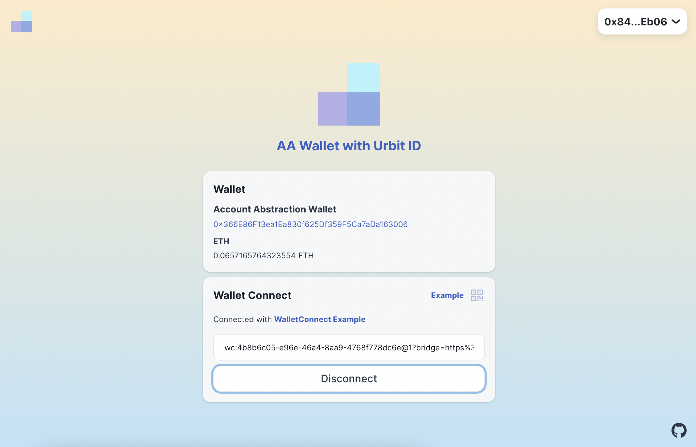
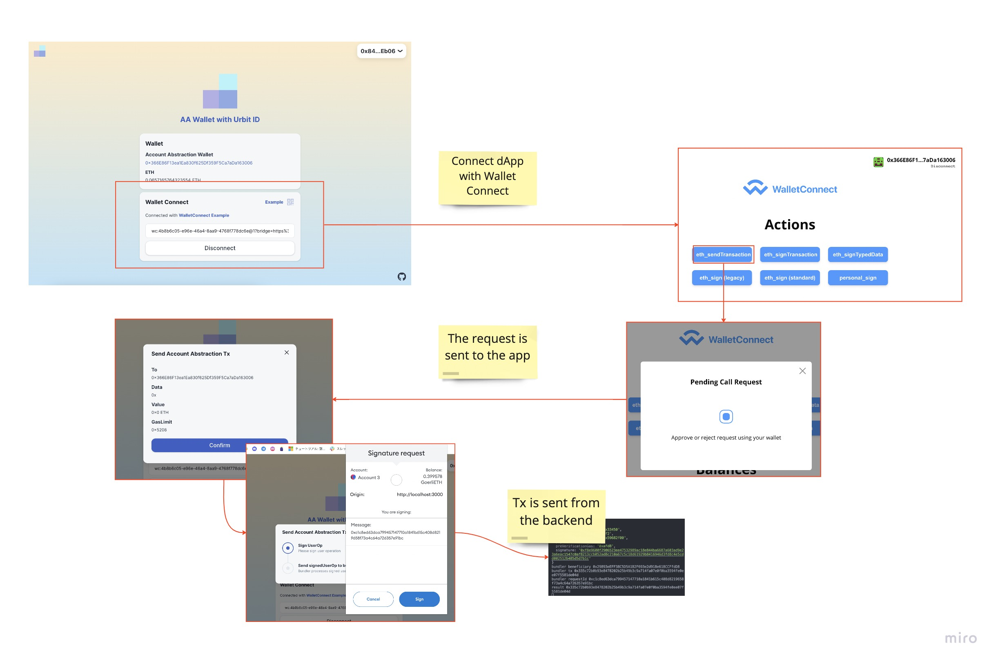
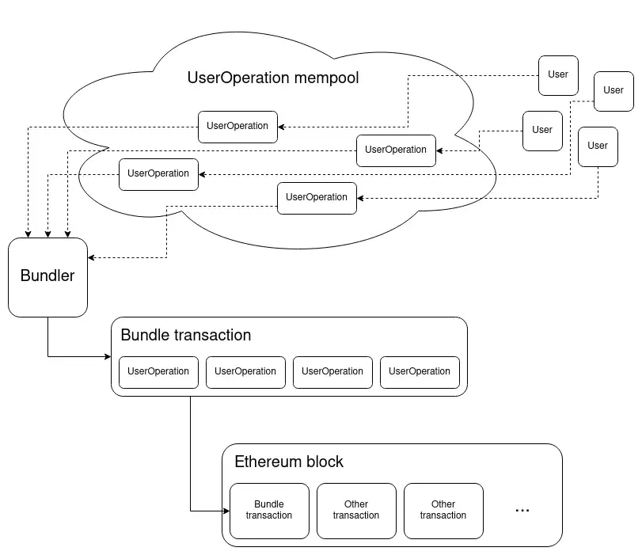
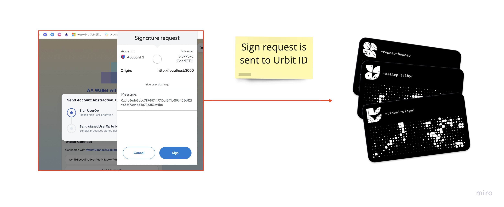

# AA Wallet with Urbit ID

## Submission

### Live App

TBD

### Pitch Deck

https://docs.google.com/presentation/d/1uyrrvSnV_JtfU4oT_cXduBpttDvWMOpzSBou6nWIxcY/edit?usp=sharing

### Pitch with Demo

TBD

## Description

This is the Account Abstraction wallet manager, Urbit ID works as a public key management infrastructure for the Account Abstraction contract wallet.

## Inspiration

https://www.youtube.com/watch?v=SsALaSdOnx8&t=1780s

This concept is inspired by the above Encode club \* Urbit workshop

## How it works

### Account Abstraction

1. Connect dApp with Wallet Connect
2. The request is sent to the app
3. Tx is sent from the backend

This is the meta-transaction process with the [ERC4337](https://medium.com/infinitism/erc-4337-account-abstraction-without-ethereum-protocol-changes-d75c9d94dc4a) account abstraction standard.

### Interact with Urbit ID

Vitalik mentioned the following benefit of Account Abstraction in the above article.

> - Multisigs and social recovery
> - More efficient and simpler signature algorithms (eg. Schnorr, BLS)

In this MVP, We added Urbit ID as public key management infrastructure, and the contract wallet can inherit key management flexibility from Urbit ID.

And [Urbit ID documentation](https://urbit.org/overview/urbit-id) says

> Soon it will also be a master key that allows holding and sending of Bitcoin and other cryptocurrencies.

This Account Abstraction approach gives more choices to users and users can enjoy the feature right now.

Account Abstraction contract wallet address is calculated counterfactually with create2.

In this MVP, it takes the Azumith contract address and token ID for the salt to verify the user operation signature against the Urbit ID owner.

### Future Development

Currently, it asks users to sign the transaction with a normal EOA wallet, but it can be integrated with the Urbit ID wallet directly when Urbit ID gets ready.
