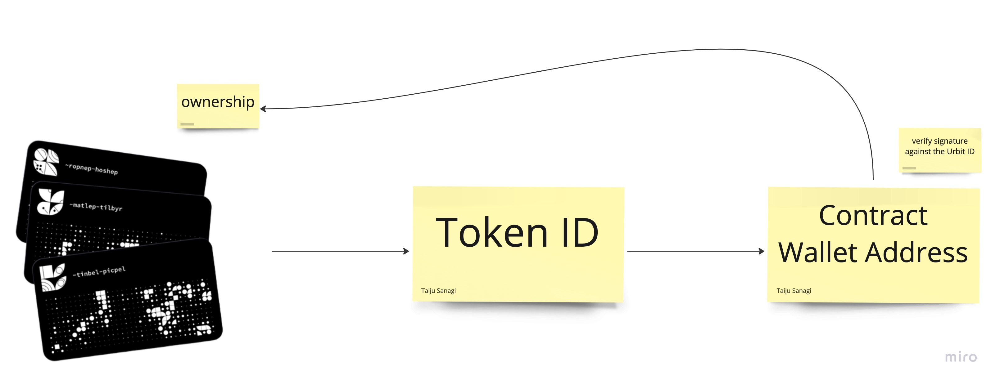

# AA Wallet with Urbit ID

## Submission

### Live App

TBD

### Pitch & Demo

TBD

## Description

This is the Account Abstraction wallet manager, Urbit works as a non-custodial agent to sign the transaction.

## Inspiration

https://www.youtube.com/watch?v=SsALaSdOnx8&t=1780s

This concept is inspired by the above Encode club \* Urbit workshop

## How it works

### Account Abstraction

1. Connect dApp with Wallet Connect
2. The request is sent to the app
3. Tx is sent from the backend

This is the meta-transaction process with the [ERC4337](https://medium.com/infinitism/erc-4337-account-abstraction-without-ethereum-protocol-changes-d75c9d94dc4a) account abstraction standard.

Vitalik mentioned signing flexibility in above document

> Verification logic flexibility: the validateUserOp function can add arbitrary signature and nonce verification logic (new signature schemes, multisig…)

We are planning to integrate with Urbit ID for a better signature experience.

### Interact with Urbit

In the above process, the request is signed by Metamask, but we are going to sign the transaction with Urbit as a non-custodial agent.

## Technical Detail

TBD
